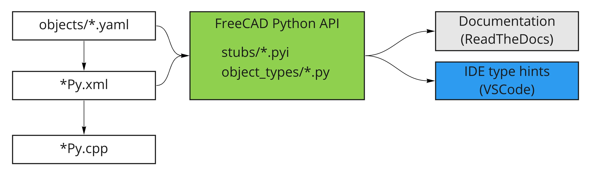

# FreeCAD python stubs

This meant to contain all the FreeCAD C++ to Python bindings, types for the Document Object property system and Scripted Object Python types.

## Structure

* `stubs/` - `*.pyi` files for FreeCAD C++ defined Python modules and packages
* `docker/` - scripts to develop sphinx documentation locally

## Generate sphinx documentation

    # rename workaround, see https://github.com/readthedocs/sphinx-autoapi/issues/243
    ./rename.sh
    # generate html
    ./docker/run.sh make clean html

## Pipeline vision

Here's how python stub files are intended to be generated and used:

We're not there yet though.

## See also

* [DocumentObject model proposal](https://github.com/FreeCAD/FreeCAD-Enhancement-Proposals/wiki/FEP03-DocumentObject-model) ([discussion](https://forum.freecadweb.org/viewtopic.php?f=10&t=49619))
